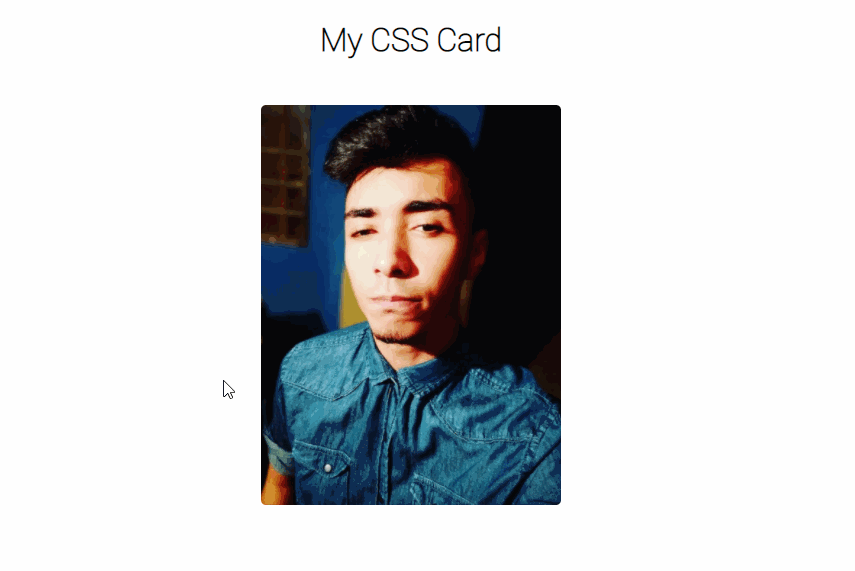

<p align='center'></p>
<h1 align='center'>Personal Card CSS</h1>
<p align='center'>
</p>

## 🚀 Sobre o projeto

Card feito apenas usando css e html


## 🚀 Começando

Essas instruções permitirão que você obtenha uma cópia do projeto em operação na sua máquina local para fins de desenvolvimento e teste.

### 📋 Pré-requisitos

Coisas você precisa para instalar o software e como instalá-lo :

```
GIT para clonar o projeto
```

### 🔧 Instalação

```
Clone ou baixe o ZIP do projeto
```

### Para executar :

```

Abrir o arquivo index.html

```

## <h3> 🖼️ Layout</h3>

<br>

 
    <br>
 
    <br>


## 🛠️ Construído com

- [Html](https://developer.mozilla.org/pt-BR/docs/Web/HTML/) 
- [Css](https://www.w3schools.com/css/)


## 🛠 💻 Para acessar o projeto funcional :

<p>

- Clique aqui > [MyPersonalCssCard](https://my-css-card.netlify.app/)

<p>

## ✒️ Autores

- **Desenvolvedor** - [Samuel Ribeiro](https://github.com/samuelrrs)

---

⌨️ por [Samuel Ribeiro](https://github.com/samuelrrs) 🚀
```
